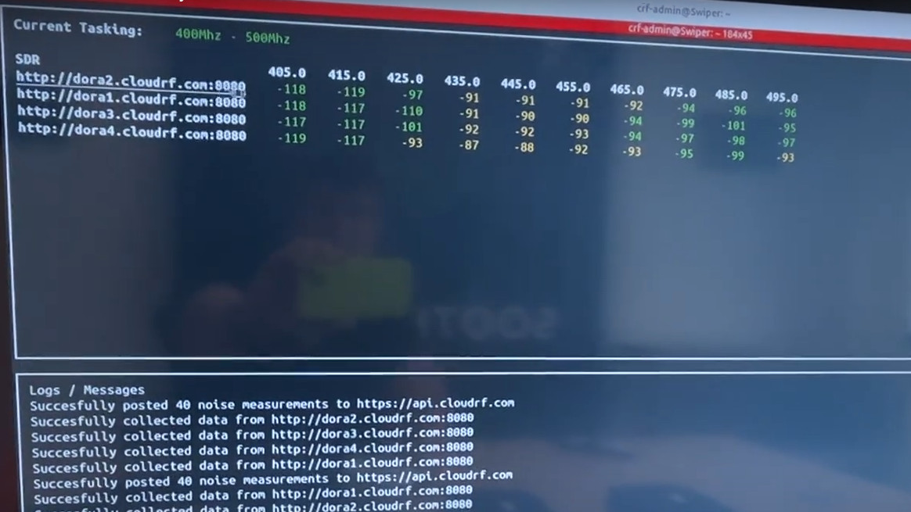
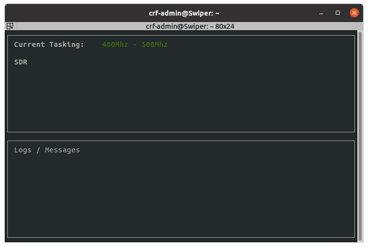
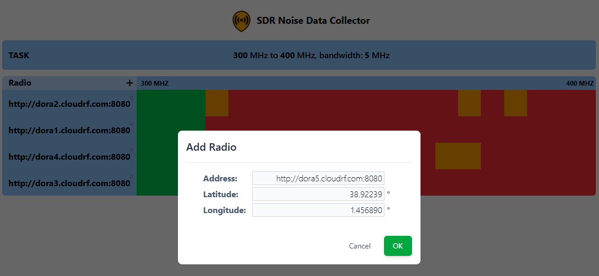
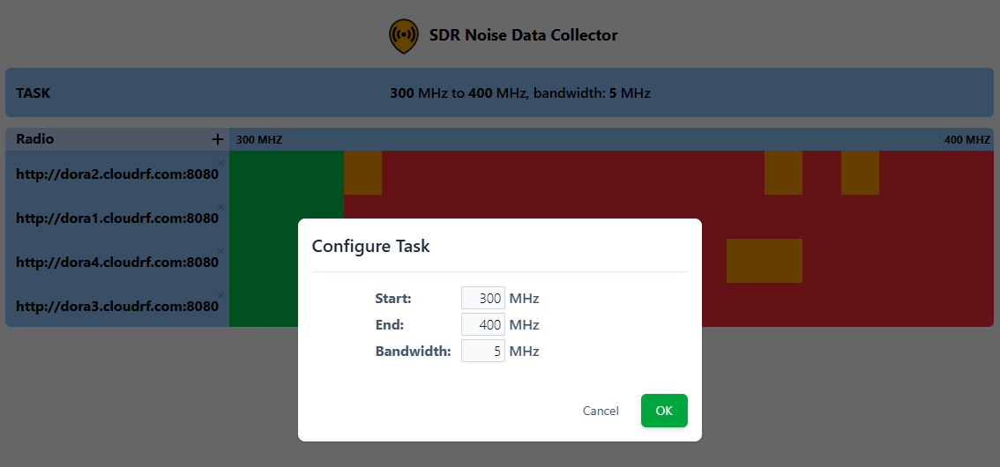
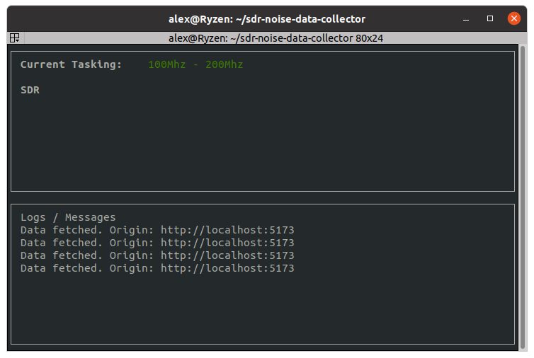

# DORA

## Distributed Open Receiver Array

## About

DORA is an API for collecting RF noise using SDRs. It was designed to support live noise collection for the CloudRF RF planning API.

It provides a scalable API and interface to task receivers and monitor RF spectrum noise in different locations. 

*It is an autonomous wideband monitoring capability with averaging. It is not intended for signal detection or analysis but can be modified to perform up to the limit of the hardware*

## Design

DORA is built upon the open source [SoapySDR](https://github.com/pothosware/SoapySDR/wiki) library and wraps the [Soapy_power](https://github.com/xmikos/soapy_power) utility to interface with low cost SDRs to fetch FFT data. A popular business model.

Each SDR is a 'node' and needs to run the node.py script. 
This serves a REST API that, when called, runs soapy_power then returns the requested PSD of noise, measured in dBm.

The server.py script collects data from the SDRs and posts it to the CloudRF [noise API](https://cloudrf.com/documentation/developer/#/Manage/noiseCreate) when an API key is provided, to support accurate SNR simulations using live data.

The REST API allows the system to be tasked, nodes to be added/removed and data to be fetched.

## Requirements

### Hardware

Only 12-bit or better resolution SDRs (Lime, SDRPlay, Ettus etc) are recommended. Low resolution 8-bit (RTL-2832, HackRF) SDRs are supported but cannot provide the resolution needed for noise measurements.

For a full list of supported SDRs, see the [SoapySDR wiki](https://github.com/pothosware/SoapySDR/wiki).

DORA was designed for SDRplay RSP1B 14-bit SDRs coupled with a Raspberry Pi4. 

The BOM for each node was < £200.

### node.py
We recommend [DragonOS Pi64](https://sourceforge.net/projects/dragonos-pi64/) as the node OS on the raspberry Pi as it has SDR drivers pre-built.

 - [DragonOS Pi64](https://sourceforge.net/projects/dragonos-pi64/)
 - python 3
 - [soapy_power](https://github.com/xmikos/soapy_power)
 - numpy
 - flask
 - waitress

### server.py
Any Linux server running Python will do. Doesn't need a desktop.

 - python 3
 - flask
 - waitress
 - requests
 - urllib3

## Installation

### Server
Install the python libraries needed for API communication with nodes.

    pip install -r requirements.txt

### Node
Install DragonOS as per the documentation, then fetch the python libraries needed. Most of the other utilities are already included eg. soapy_power

    pip install -r requirements.txt

## Operation

On the node(s), start the node.py script. You may want to set this to auto start with a systemd service. This will start a web server on TCP port 8080 to listen for API requests from the server.

    python3 node.py

On the server, define a configuration within config.json. You can enter your SDRs at this point or do it later via the web interface. To define an SDR you need an address, latitude and longitude.

    {
        "start_mhz": 400,
        "end_mhz": 500,
        "bandwidth_mhz": 10,
        "cloudrf_api": "",
        "cloudrf_api_key": "",
        "sdrs": [
            {"address": "http://dora1:8080", "latitude": 46.295, "longitude": 6.1699}, 
            {"address": "http://dora2:8080", "latitude": 46.3037, "longitude": 6.1792}, 
            {"address": "http://dora3:8080", "latitude": 46.3131, "longitude": 6.1865}, 
            {"address": "http://dora4:8080", "latitude": 46.3205, "longitude": 6.195}
        ]
    }

Once you have saved your configuration, start the program and expect a split screen showing live data on the top and message logs on the bottom. If it can communicate, you will see data.
    
    python3 server.py

### CloudRF integration

If you want to send data direct to your CloudRF account to create live [noise maps](https://cloudrf.com/mapping-noise/), you must enter your API key into the configuration file. 

        "cloudrf_api": "https://api.cloudrf.com",
        "cloudrf_api_key": "canyouhearthemusic",
*Noise data is private to your account and is kept for several days only.*

# Web interface

There's even a funky web interface.
You must create a .env file within the UI folder containing the variable VITE_API_URL_BASE for the API which by default listens on port 8080. For example:

    echo "VITE_API_URL_BASE=http://localhost:8080" > ui/.env

cd into the ui folder and run yarn dev

    cd ui
    yarn dev

A web server will be started on port 5173 which you can access at https://localhost:5173

You can see the web UI fetching data from the server console every 5 seconds:

To add a radio click +

To delete a radio click X

To change the TASK click TASK, enter the start and stop frequencies and bandwidth in MHz then click OK

### Performance note

Bandwidth and sample rate will be limited by your hardware. If you have a small SDR, chances are it can only manage 10MHz maximum. The system will sample an FFT matched to this, then retune. If you have a large piece of spectrum, this could take a while.